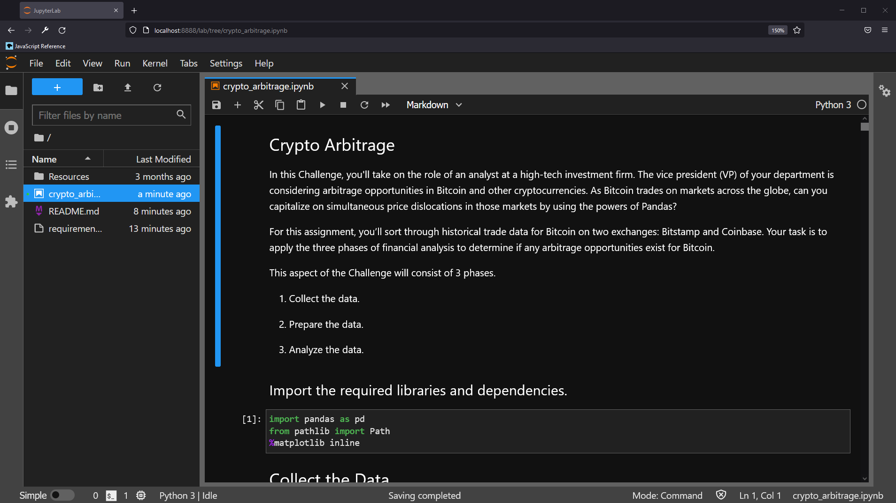

# Bitcoin Exchange Arbitrage Analysis

Welcome to the **03_Module_Challenge** Jupyter Notebook!

The included Jupyter Notebook seeks to identify potential arbitrage opportunities that may have been present in the Bitcoin (BTC) closing price between the Bitstamp and Coinbase exchanges during the first four months of 2018.

Please refer to the notebook to examine the performed analysis and conclusions regarding potential arbitrage.

---

## Technologies

This `python` based script utilizes the modules found in: 
> `requirements.txt`

---

## Installation Guide

The most straightforward method for interacting with the included materials is from within an **anaconda environment**. Instructions for installing anaconda may be found [here](https://www.anaconda.com/products/individual).

---

## Examples

A successful activation of the Jupyter Lab Notebook in a browser will appear similar to this screenshot:

---

## Usage

Once the necessary modules/libraries have been installed, launch the Jupyter Lab either via the command line or from within an IDE capable of opening the `.ipynb` file extension. From there, all steps performed, accompanying outputs, and analysis can be observed in sequence from top to bottom.

---

## Contributors

Forrest Surles

---

## License

Copyright 2021 - Forrest Surles

Permission is hereby granted, free of charge, to any person obtaining a copy of this software and associated documentation files (the "Software"), to deal in the Software without restriction, including without limitation the rights to use, copy, modify, merge, publish, distribute, sublicense, and/or sell copies of the Software, and to permit persons to whom the Software is furnished to do so, subject to the following conditions:

The above copyright notice and this permission notice shall be included in all copies or substantial portions of the Software.

THE SOFTWARE IS PROVIDED "AS IS", WITHOUT WARRANTY OF ANY KIND, EXPRESS OR IMPLIED, INCLUDING BUT NOT LIMITED TO THE WARRANTIES OF MERCHANTABILITY, FITNESS FOR A PARTICULAR PURPOSE AND NONINFRINGEMENT. IN NO EVENT SHALL THE AUTHORS OR COPYRIGHT HOLDERS BE LIABLE FOR ANY CLAIM, DAMAGES OR OTHER LIABILITY, WHETHER IN AN ACTION OF CONTRACT, TORT OR OTHERWISE, ARISING FROM, OUT OF OR IN CONNECTION WITH THE SOFTWARE OR THE USE OR OTHER DEALINGS IN THE SOFTWARE.

